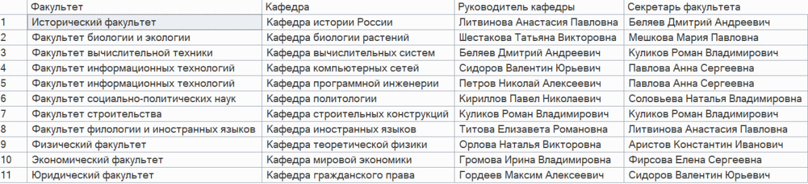
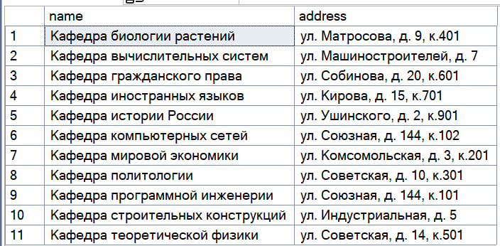
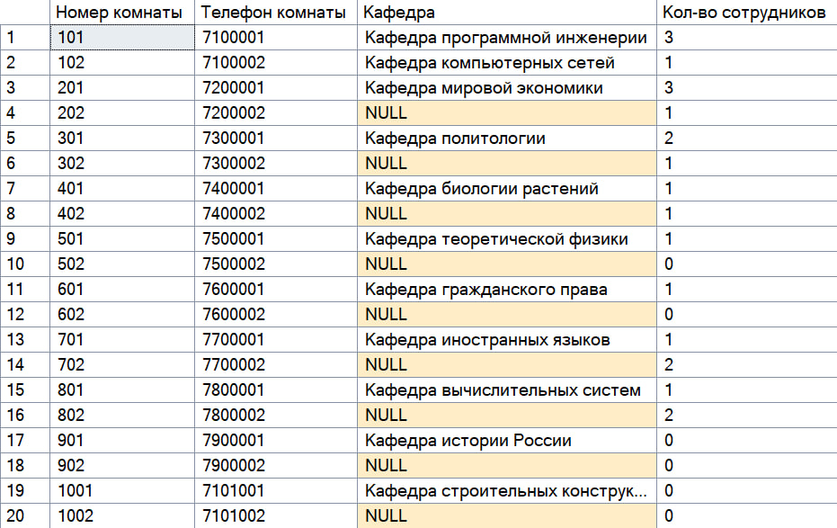
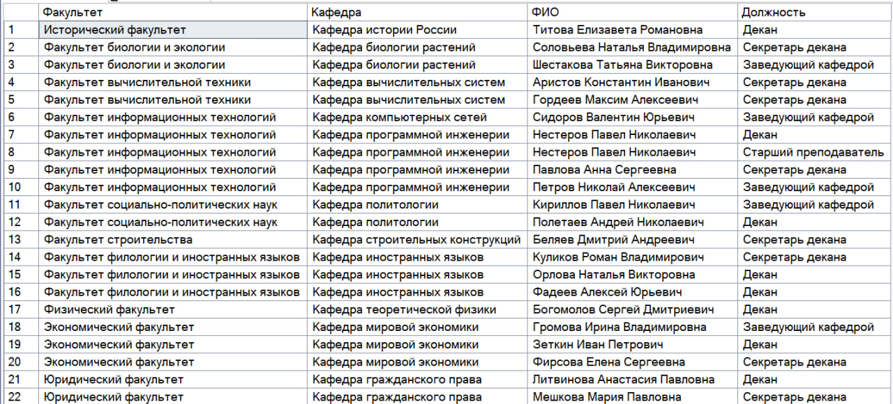
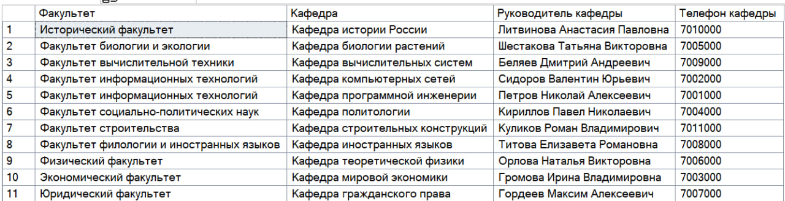

<h1 name="content" align="center"><a href="">
</a> MSSQL</h1>

<p align="center">
  <a href="#-lab1"></a> 
  <a href="#-lab2"></a>
  <a href="#-lab3"></a>
  <a href="#-lab4"></a>
</p>

<h3 align="center">
  <a href="#client"></a>
  Вариант 10. Справочник вуза
  
Факультеты: название, адрес, телефон, ФИО руководителя,  ФИО секретаря, список общефакультетских  помещений;
Кафедры: название, адрес, телефон, ФИО руководителя,  ФИО секретаря, список помещений кафедры;
Сотрудники подразделений: ФИО,  должность(лаборан,|ассистент,преподаватель,старший преподаватель ,доцент,профессор),  паспорт, телефон;

Реализовать:
- Поиск сотрудников по фамилии (выдача всей информации);
- Выдача информации о комнате (к какой кафедре относится, список сотрудников, работающих в комнате);
- Выдача информации о подразделении (номера комнат,относящихся к подразделению, телефоны комнат, список сотрудников по каждой комнате);
- Вывод телефонного справочника по кафедрам для одного факультета;
- Вывод телефонного справочника факультетов.

</h3>

#  Lab1
[Назад](#content)
<h3 align="center">
  <a href="#client"></a>
  Разработать ER-модель данной предметной области: выделить сущности, их атрибуты, связи между сущностями. 
Для каждой сущности указать ее имя, атрибут (или набор атрибутов), являющийся первичным ключом, список остальных атрибутов.
Для каждого атрибута указать его тип, ограничения, может ли он быть пустым, является ли он первичным ключом.
Для каждой связи между сущностями указать: 
- тип связи (1:1, 1:M, M:N)
- обязательность

ER-модель д.б. представлена в виде ER-диаграммы (картинка)

По имеющейся ER-модели создать реляционную модель данных и отобразить ее в виде списка сущностей с их атрибутами и типами атрибутов,  для атрибутов указать, явл. ли он первичным или внешним ключом 
</h3>


#### №1. ER-модель


#### №1.1. Реляционная модель


# <a name="-lab2"></a> Лабораторная работа №2
<p align="justify">
<h3>
  <a href="#client"></a>
 
 Задание:
  В соответствии с реляционной моделью данных, разработанной в Лаб.№1, создать реляционную БД на учебном сервере БД :
- создать таблицы, определить первичные ключи и иные ограничения
- определить связи между таблицами
- создать диаграмму
- заполнить все таблицы адекватной информацией (не меньше 10 записей в таблицах, наличие примеров для связей типа 1:M )

</h3>

[Посмотреть SQL-код создания таблицы](https://github.com/ekatherina123/databases_Tyumeneva_PMI-32_10_var/blob/main/LAB2)

<h3>
  Диаграмма таблицы:
  
  
  
</h3>
  
<h3>
  Таблицы
</h3>
<h4>
  Факультет:
  
</h4>
<h4>
  Кафедра:
  
</h4>

<h4>
  Сотрудник:
  
</h4>
<h4>
  Должность:
  
</h4>
<h4>
  Сотрудник - должность:
  
</h4>
<h4>
   Помещение:
  
</h4>
<h4>
  Сотрудник - помещение:
  
</h4>

# <a name="-lab3"></a> Лабораторная работа №3

<p align="justify">
<h3>
  <a href="#client"></a>

Часть 1 [Посмотреть SQL запросы и их результаты](https://github.com/ekatherina123/databases_Tyumeneva_PMI-32_10_var/blob/main/LAB3/Тюменева_ПМИ_32_часть1.docx)

Цель: изучить конструкции языка SQL для манипулирования данными в СУБД  MSSQL.
Задания и краткое описание работы:
1. Выборка из одной таблицы.
2. Выборка из нескольких таблиц.
3. Представления
4. Функции ранжирования
5. Объдинение, пересечение, разность
6. Использование CASE, PIVOT и UNPIVOT.

Часть 2 [Посмотреть SQL запросы и их результаты](https://github.com/ekatherina123/databases_Tyumeneva_PMI-32_10_var/blob/main/LAB3/Тюменева_ПМИ_32_часть2.docx)

Составить следующие запросы:
a)  Для каждого факультета вывести список кафедр с ФИО руководителя и секретаря  
b)  Выдать список адресов, по которым находятся подразделения  
c)  Для каждой комнаты выдать название кафедры, телефон, кол-во сотрудников  
d)  Вывести список сотрудников, упорядоченный по факультету, кафедре, ФИО  
e)  Вывести список телефонов для всех подразделений  
</h3>

# <a name="-lab4"></a> Лабораторная работа №4

<ol type="a">
	<h3>Создать 4 различных хранимых процедуры:</h3>

a) Процедура без параметров, формирующая список руководителей и секретарей факультетов с телефонами и номерами комнат


```
CREATE PROCEDURE GetFacultyLeaders
AS
BEGIN
    SELECT 
        f.name AS faculty_name,
        dean.full_name AS dean_name,
        dean.phone AS dean_phone,
        dean_room.number AS dean_room,

        sec.full_name AS secretary_name,
        sec.phone AS secretary_phone,
        sec_room.number AS secretary_room
    FROM Faculty f
    LEFT JOIN Employee dean ON f.dean_id = dean.id
    LEFT JOIN Employee_Room dr ON dean.id = dr.employee_id
    LEFT JOIN Room dean_room ON dr.room_id = dean_room.id

    LEFT JOIN Employee sec ON f.secretary_id = sec.id
    LEFT JOIN Employee_Room sr ON sec.id = sr.employee_id
    LEFT JOIN Room sec_room ON sr.room_id = sec_room.id;
END;
GO
EXEC GetFacultyLeaders;
```


b) Процедура, на входе получающая название факультета и формирующая список комнат, которые занимают все кафедры факультета, и общефакультетских помещений
```

CREATE PROCEDURE GetFacultyRooms
    @FacultyName NVARCHAR(100)
AS
BEGIN
    SELECT DISTINCT 
        r.id AS room_id,
        r.number AS room_number,
        r.phone AS room_phone,
        d.name AS department_name
    FROM Faculty f
    JOIN Room r ON r.faculty_id = f.id
    LEFT JOIN Department d ON d.room_id = r.id
    WHERE f.name = @FacultyName;
END;
GO
EXEC GetFacultyRooms @FacultyName = N'Факультет информационных технологий';
```


c) Процедура, на входе получающая номер комнаты, выходной параметр –название факультета, которому она принадлежит

```
CREATE PROCEDURE GetFacultyByRoom
    @RoomNumber INT
AS
BEGIN
    SELECT f.name AS FacultyName
    FROM Room r
    JOIN Faculty f ON r.faculty_id = f.id
    WHERE r.number = @RoomNumber;
END;
GO
EXEC GetFacultyByRoom 101;

```


d) Процедура, вызывающая вложенную процедуру, которая находит среднюю численность сотрудников в одой комнате, а сама формирует список комнат с численностью сотрудников > средней в форме: факультет, кафедра, комната, количество сотрудников

  
```
--Вложенная процедура — считает среднее число сотрудников в одной комнате

IF OBJECT_ID('GetAverageEmployeesPerRoom', 'P') IS NOT NULL
    DROP PROCEDURE GetAverageEmployeesPerRoom;
GO

CREATE PROCEDURE GetAverageEmployeesPerRoom
    @AvgCount FLOAT OUTPUT
AS
BEGIN
    SELECT @AvgCount = AVG(cnt)
    FROM (
        SELECT room_id, COUNT(*) AS cnt
        FROM Employee_Room
        GROUP BY room_id
    ) AS t;
END;
GO

DECLARE @avg FLOAT;
EXEC GetAverageEmployeesPerRoom @AvgCount = @avg OUTPUT;
SELECT @avg AS AverageEmployeesPerRoom;


--Основная процедура — показывает комнаты,в которых сотрудников больше среднего

IF OBJECT_ID('GetRoomsAboveAverage', 'P') IS NOT NULL
    DROP PROCEDURE GetRoomsAboveAverage;
GO

CREATE PROCEDURE GetRoomsAboveAverage
AS
BEGIN
    DECLARE @avg FLOAT;

    EXEC GetAverageEmployeesPerRoom @AvgCount = @avg OUTPUT;

    SELECT 
        f.name AS Faculty,
        d.name AS Department,
        r.number AS RoomNumber,
        COUNT(er.employee_id) AS EmployeeCount
    FROM Room r
    LEFT JOIN Faculty f ON r.faculty_id = f.id
    LEFT JOIN Department d ON d.room_id = r.id  
    LEFT JOIN Employee_Room er ON er.room_id = r.id
    GROUP BY f.name, d.name, r.number
    HAVING COUNT(er.employee_id) > @avg;
END;
GO

EXEC GetRoomsAboveAverage;


```

</ol>

<ol type="a">
<h3>3	пользовательских функции:</h3>

a) Скалярная функция: по фамилии сотрудника выводит название его факультета
  
```  
CREATE OR ALTER FUNCTION dbo.GetFacultyByEmployeeSurname
(
    @Surname NVARCHAR(100)
)
RETURNS NVARCHAR(100)
AS
BEGIN
    DECLARE @FacultyName NVARCHAR(100);

    SELECT TOP 1 @FacultyName = f.name
    FROM Employee e
    JOIN Employee_Room er ON e.id = er.employee_id
    JOIN Room r ON er.room_id = r.id
    JOIN Faculty f ON r.faculty_id = f.id
    WHERE e.full_name LIKE @Surname + '%';

    RETURN @FacultyName;
END;
GO

SELECT dbo.GetFacultyByEmployeeSurname(N'Куликов') AS FacultyName;

```


b) Inline-функция, возвращающая список телефонов кафедр заданного факультета


```
CREATE OR ALTER FUNCTION dbo.GetDepartmentPhonesByFaculty
(
    @FacultyName NVARCHAR(100)
)
RETURNS TABLE
AS
RETURN
(
    SELECT d.name AS DepartmentName, d.phone AS DepartmentPhone
    FROM Department d
    JOIN Room r ON d.room_id = r.id
    JOIN Faculty f ON r.faculty_id = f.id
    WHERE f.name = @FacultyName
);
GO

SELECT * FROM dbo.GetDepartmentPhonesByFaculty(N'Факультет информационных технологий');

```


c) Multi-statement-функция, выдающая количество различных должностей по кафедрам заданного факультета в виде:
Кафедра |лаборант|ассистент|преподаватель|старший преподаватель |доцент|профессор

```
CREATE OR ALTER FUNCTION dbo.GetPositionCountsByFaculty
(
    @FacultyName NVARCHAR(100)
)
RETURNS @Result TABLE
(
    DepartmentName NVARCHAR(100),
    LabAssistant INT,
    Assistant INT,
    Teacher INT,
    SeniorTeacher INT,
    Docent INT,
    Professor INT
)
AS
BEGIN
    INSERT INTO @Result
    SELECT 
        d.name AS DepartmentName,
        SUM(CASE WHEN p.position_name = 'лаборант' THEN 1 ELSE 0 END) AS LabAssistant,
        SUM(CASE WHEN p.position_name = 'ассистент' THEN 1 ELSE 0 END) AS Assistant,
        SUM(CASE WHEN p.position_name = 'преподаватель' THEN 1 ELSE 0 END) AS Teacher,
        SUM(CASE WHEN p.position_name = 'старший преподаватель' THEN 1 ELSE 0 END) AS SeniorTeacher,
        SUM(CASE WHEN p.position_name = 'доцент' THEN 1 ELSE 0 END) AS Docent,
        SUM(CASE WHEN p.position_name = 'профессор' THEN 1 ELSE 0 END) AS Professor
    FROM Department d
    JOIN Room r ON d.room_id = r.id
    JOIN Faculty f ON r.faculty_id = f.id
    LEFT JOIN Employee_Room er ON er.room_id = r.id
    LEFT JOIN Employee e ON er.employee_id = e.id
    LEFT JOIN Employee_Position ep ON ep.employee_id = e.id
    LEFT JOIN Position p ON ep.position_id = p.id
    WHERE f.name = @FacultyName
    GROUP BY d.name;

    RETURN;
END;
GO

SELECT * FROM dbo.GetPositionCountsByFaculty(N'Факультет информационных технологий');


```


</ol>
<ol type="a">
<h3>Создать  3 триггера:</h3>
a) Триггер любого типа на добавление нового помещения для кафедры – если комната с этим номером закреплена за др.кафедрой или факультетом, то она для данной кафедры не добавляется, выводится соотв.сообщение


```
CREATE OR ALTER TRIGGER TR_Room_Insert_Check
ON Room
INSTEAD OF INSERT
AS
BEGIN
    SET NOCOUNT ON;

    IF EXISTS (
        SELECT 1
        FROM Room r
        JOIN inserted i ON r.number = i.number
        WHERE ISNULL(r.faculty_id, -1) <> ISNULL(i.faculty_id, -1)
    )
    BEGIN
        PRINT 'Комната уже закреплена за другим факультетом. Добавление отменено.';
        RETURN;
    END;

    INSERT INTO Room (number, phone, faculty_id)
    SELECT number, phone, faculty_id
    FROM inserted;
END;
GO


INSERT INTO Room (number, phone, faculty_id)
VALUES
(101, '7999999', 3), -- не вставится
(1005, '7900000', 8); -- вставится

```


b)  Последующий триггер на изменение номера комнаты для сотрудника – если новая комната принадлежит не его кафедре, то номер не меняется, выводится соотв.сообщение

```
CREATE OR ALTER TRIGGER TR_EmployeeRoom_Update
ON Employee_Room
AFTER UPDATE
AS
BEGIN
    SET NOCOUNT ON;

    DECLARE 
        @emp INT,
        @new_room INT,
        @old_room INT,
        @empDept INT,
        @deptFaculty INT,
        @roomFaculty INT;

    DECLARE cur CURSOR FOR
        SELECT i.employee_id, i.room_id, d.room_id
        FROM inserted i
        JOIN deleted d ON i.employee_id = d.employee_id;

    OPEN cur;
    FETCH NEXT FROM cur INTO @emp, @new_room, @old_room;

    WHILE @@FETCH_STATUS = 0
    BEGIN
        SELECT @empDept = department_id FROM Employee WHERE id = @emp;
        SELECT @deptFaculty = faculty_id FROM Department WHERE Id = @empDept;
        SELECT @roomFaculty = faculty_id FROM Room WHERE id = @new_room;

        IF @deptFaculty <> @roomFaculty
        BEGIN
            PRINT 'Сотруднику нельзя назначить комнату, принадлежащую другому факультету. Изменение отменено.';

            UPDATE Employee_Room
            SET room_id = @old_room
            WHERE employee_id = @emp;
        END

        FETCH NEXT FROM cur INTO @emp, @new_room, @old_room;
    END;

    CLOSE cur;
    DEALLOCATE cur;
END;
GO
UPDATE Employee_Room
SET room_id = 2
WHERE employee_id = 1;
SELECT * FROM Employee_Room;

```


c) Замещающий триггер на операцию удаления комнаты из списка помещений кафедры – если там размещаются сотрудники кафедры, то комната из списка не удаляется, выводится соотв.сообщение


```
CREATE OR ALTER TRIGGER TR_Room_Delete
ON Room
INSTEAD OF DELETE
AS
BEGIN
    SET NOCOUNT ON;

    DECLARE
        @room INT,
        @cnt INT;

    DECLARE cur_del CURSOR FOR
        SELECT id FROM deleted;

    OPEN cur_del;
    FETCH NEXT FROM cur_del INTO @room;

    WHILE @@FETCH_STATUS = 0
    BEGIN
        SELECT @cnt = COUNT(*) 
        FROM Employee_Room
        WHERE room_id = @room;

        IF @cnt > 0
        BEGIN
            PRINT 'Комната ' + CAST(@room AS NVARCHAR(10)) 
                + ' не может быть удалена – там размещаются сотрудники.';
        END
        ELSE
        BEGIN
            DELETE FROM Room WHERE id = @room;
        END

        FETCH NEXT FROM cur_del INTO @room;
    END;

    CLOSE cur_del;
    DEALLOCATE cur_del;
END;
GO

DELETE FROM Room
WHERE id IN (1,21,22); 

```
комнаты с id 21 и 22 удалились, для комнаты с id 1 выведено сообщение об ошибке

</ol>

#  Lab6
[Назад](#content)
<h3 align="center">
  <a href="#client"></a>
</h3>

<div>
  <h4>Создание графовых таблиц и работа с ними</h4>
  
  <p><b>Задание 1:</b></p>
  <ol>
    <li>Используйте реляционную БД из лабораторной работы №2.</li>
    <li>Продумайте и создайте графовые таблицы по реляционной БД, заполните графовые таблицы используя данные в реляционных таблицах.</li>
    <li>ЗНапишите запросы из задания 3.2 используя паттерн MATCH.</li>
    <li>Сравните полученные результаты  с  результатами запросов к реляционной модели.</li>
  </ol>
  
  <p><b>Отчет предоставить в виде:</b></p>
  <ul>
    <li>Схема узлов и ребер.</li>

    <li>Скрипт для создания и заполнения графовых таблиц</li>
<pre><code>
DROP TABLE IF EXISTS Graph_Faculty;
DROP TABLE IF EXISTS Graph_Department;
DROP TABLE IF EXISTS Graph_Room;
DROP TABLE IF EXISTS Graph_Employee;
DROP TABLE IF EXISTS Graph_Position;

DROP TABLE IF EXISTS HAS_Department;
DROP TABLE IF EXISTS HAS_ROOM;
DROP TABLE IF EXISTS EMPLOYS;
DROP TABLE IF EXISTS WORKS_AS;
DROP TABLE IF EXISTS WORKS_IN ;
DROP TABLE IF EXISTS HEADED_BY;
DROP TABLE IF EXISTS HAS_SECRETARY;
DROP TABLE IF EXISTS MANAGED_BY;
GO

CREATE TABLE Graph_Faculty (
    id INT PRIMARY KEY,
    name NVARCHAR(100),
    phone NVARCHAR(15),
    address NVARCHAR(300)
) AS NODE;

CREATE TABLE Graph_Department (
    id INT PRIMARY KEY,
    name NVARCHAR(100),
    phone NVARCHAR(15),
    address NVARCHAR(300)
) AS NODE;

CREATE TABLE Graph_Room (
    id INT PRIMARY KEY,
    number INT,
    phone NVARCHAR(15)
) AS NODE;

CREATE TABLE Graph_Employee (
    id INT PRIMARY KEY,
    full_name NVARCHAR(100),
    passport CHAR(15),
    phone NVARCHAR(15)
) AS NODE;

CREATE TABLE Graph_Position (
    id INT PRIMARY KEY,
    position_name NVARCHAR(100),
    base_salary MONEY
) AS NODE;
GO

CREATE TABLE HAS_Department AS EDGE;
CREATE TABLE HAS_ROOM  AS EDGE;
CREATE TABLE EMPLOYS AS EDGE;
CREATE TABLE WORKS_AS AS EDGE;
CREATE TABLE WORKS_IN  AS EDGE;
CREATE TABLE HEADED_BY AS EDGE;
CREATE TABLE HAS_SECRETARY AS EDGE;
CREATE TABLE MANAGED_BY AS EDGE;
GO

-- Вставляем данные в узлы
INSERT INTO Graph_Faculty (id, name, phone, address)
SELECT ID, name, phone, address FROM Faculty;

INSERT INTO Graph_Department(id, name, phone, address)
SELECT Id, name, phone, address FROM Department;

INSERT INTO Graph_Room (id, number, phone)
SELECT id, number, phone FROM Room;

INSERT INTO Graph_Employee (id, full_name, passport, phone)
SELECT id, full_name, passport, phone FROM Employee;

INSERT INTO Graph_Position (id, position_name, base_salary)
SELECT id, position_name, base_salary FROM Position;
GO

-- Вставляем данные в ребра
INSERT INTO HAS_Department ($from_id, $to_id)
SELECT f.$node_id, d.$node_id
FROM Graph_Faculty f
JOIN Graph_Department d ON EXISTS (
    SELECT 1 FROM Department dept 
    WHERE dept.Id = d.id AND dept.faculty_id = f.id
);

INSERT INTO HAS_ROOM  ($from_id, $to_id)
SELECT d.$node_id, r.$node_id
FROM Graph_Department d
JOIN Graph_Room r ON EXISTS (
    SELECT 1 FROM Department dept 
    WHERE dept.Id = d.id AND dept.room_id = r.id
);

INSERT INTO EMPLOYS ($from_id, $to_id)
SELECT d.$node_id, e.$node_id
FROM Graph_Department d
JOIN Graph_Employee e ON EXISTS (
    SELECT 1 FROM Employee emp 
    WHERE emp.id = e.id AND emp.department_id = d.id
);

INSERT INTO WORKS_AS ($from_id, $to_id)
SELECT e.$node_id, p.$node_id
FROM Employee_Position ep
JOIN Graph_Employee e ON e.id = ep.employee_id
JOIN Graph_Position p ON p.id = ep.position_id;

INSERT INTO WORKS_IN  ($from_id, $to_id)
SELECT e.$node_id, r.$node_id
FROM Employee_Room er
JOIN Graph_Employee e ON e.id = er.employee_id
JOIN Graph_Room r ON r.id = er.room_id;

INSERT INTO HEADED_BY ($from_id, $to_id)
SELECT f.$node_id, e.$node_id
FROM Graph_Faculty f
JOIN Graph_Employee e ON EXISTS (
    SELECT 1 FROM Faculty fac 
    WHERE fac.ID = f.id AND fac.dean_id = e.id
);

INSERT INTO HAS_SECRETARY ($from_id, $to_id)
SELECT f.$node_id, e.$node_id
FROM Graph_Faculty f
JOIN Graph_Employee e ON EXISTS (
    SELECT 1 FROM Faculty fac 
    WHERE fac.ID = f.id AND fac.secretary_id = e.id
);

INSERT INTO MANAGED_BY ($from_id, $to_id)
SELECT d.$node_id, e.$node_id
FROM Graph_Department d
JOIN Graph_Employee e ON EXISTS (
    SELECT 1 FROM Department dept 
    WHERE dept.Id = d.id AND dept.head_id = e.id
);

</code></pre>
    <li>Запросы из задания 3.2 к двум моделям(реляционная, графовая).</li>
  </ul>
<ol>
  <li> Для каждого факультета вывести список кафедр с ФИО руководителя и секретаря:</li>
<pre><code>
SELECT 
    f.name AS [Факультет],
    d.name AS [Кафедра],
    head_emp.full_name AS [Руководитель кафедры],
    sec_emp.full_name AS [Секретарь факультета]
FROM 
    Graph_Faculty f,
    HAS_Department hd,
    Graph_Department d,
    MANAGED_BY mb,
    Graph_Employee head_emp,
    HAS_SECRETARY hs,
    Graph_Employee sec_emp
WHERE 
    MATCH(f-(hd)->d-(mb)->head_emp AND f-(hs)->sec_emp)
ORDER BY 
    f.name, d.name;
	
</code></pre>

  <li> Выдать список адресов, по которым находятся подразделения</li>
<pre><code>
	
SELECT 
    d.name,
    d.address
FROM 
    Graph_Faculty f,
    HAS_Department efd,
    Graph_Department d
WHERE 
    MATCH(f-(efd)->d)
ORDER BY 
    d.name;
	
</code></pre>

  <li> Для каждой комнаты выдать название кафедры, телефон, кол-во сотрудников, работающих в этой комнате</li>
<pre><code>
SELECT 
    r.number AS [Номер комнаты],
    r.phone AS [Телефон комнаты],
    (SELECT TOP 1 d.name 
     FROM Graph_Department d, HAS_ROOM hr 
     WHERE MATCH(d-(hr)->r)) AS [Кафедра],
    (SELECT COUNT(DISTINCT e.id) 
     FROM Graph_Employee e, WORKS_IN wi 
     WHERE MATCH(e-(wi)->r)) AS [Кол-во сотрудников]
FROM 
    Graph_Room r
ORDER BY 
    r.number;
	
</code></pre>

  <li> Вывести список сотрудников, упорядоченный по: факультету, кафедре, ФИО (на выходе: название факультета, название кафедры, ФИО, должность)</li>
<pre><code>
SELECT 
    f.name AS [Факультет],
    d.name AS [Кафедра],
    e.full_name AS [ФИО],
    p.position_name AS [Должность]
FROM 
    Graph_Faculty f,
    HAS_Department hd,
    Graph_Department d,
    EMPLOYS emp_edge,
    Graph_Employee e,
    WORKS_AS wa,
    Graph_Position p
WHERE 
    MATCH(f-(hd)->d-(emp_edge)->e-(wa)->p)
ORDER BY 
    f.name, d.name, e.full_name;
	
</code></pre>

  <li> Вывести список телефонов для всех подразделений (факультет, кафедра, ФИО руководителя, номер телефона)</li>
<pre><code>
SELECT 
    f.name AS [Факультет],
    d.name AS [Кафедра],
    head_emp.full_name AS [Руководитель кафедры],
    d.phone AS [Телефон кафедры]
FROM 
    Graph_Faculty f,
    HAS_Department hd,
    Graph_Department d,
    MANAGED_BY mb,
    Graph_Employee head_emp
WHERE 
    MATCH(f-(hd)->d-(mb)->head_emp)
ORDER BY 
    f.name, d.name;
	
</code></pre>

</ol>
</div>


